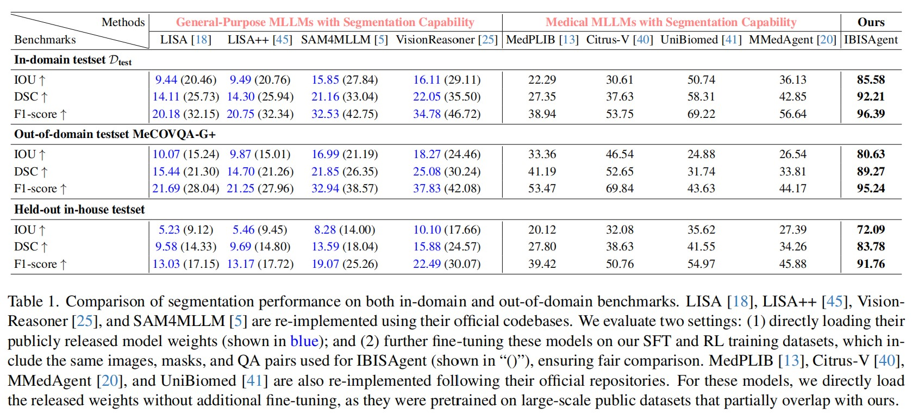

<div align="center">
    <h1 align="center">[CVPR 2026] IBISAgent: Reinforcing Pixel-Level Visual Reasoning in MLLMs for Universal Biomedical Object Referring and Segmentation
    </h1>
</div>


<p align="center">
  
</p>

- **Authors**: Yankai Jiang, Qiaoru Li, Binlu Xu, Haoran Sun, Chao Ding, Junting Dong, [Yuxiang Cai](mailto:caiyuxiang@zju.edu.cn)📧, Xuhong Zhang, Jianwei Yin
- **Institutes**: Zhejiang University; Shanghai AI Laboratory
- **Resources**: [📖[Paper](https://arxiv.org/abs/2601.03054)]  [🤗[Huggingface](https://huggingface.co/manglu3935/IBIS/tree/main)]

## 📖 Introduction

**IBISAgent** is a novel agentic Multimodal Large Language Model (MLLM) framework designed to address the limitations of existing medical MLLMs in fine-grained pixel-level understanding. unlike previous approaches that rely on implicit segmentation tokens and single-pass reasoning, IBISAgent reformulates segmentation as a **vision-centric, multi-step decision-making process**.

By treating segmentation tools (e.g., MedSAM2) as plug-and-play modules controllable through natural language, IBISAgent iteratively generates interleaved **reasoning (Thinking)** and **text-based click actions (Action)** to progressively refine segmentation masks. This approach mimics the interactive behavior of human experts, allowing for self-correction and high-quality mask generation without requiring architectural modifications to the MLLM.

<p align="center">
  <!-- Placeholder for introduction figure, please convert tex/img/introduction.pdf to png -->
  
</p>

## 💡 Highlights

- 🔥 **Agentic Reasoning Framework.** We reformulate medical image segmentation as a multi-step Markov Decision Process (MDP), enabling the model to "think" and "act" iteratively to solve complex visual grounding tasks.
- 🔥 **No Implicit Tokens.** IBISAgent eliminates the need for special `<SEG>` tokens and external pixel decoders, preserving the LLM's inherent text generation capabilities and ensuring better generalization.
- 🔥 **Two-Stage Training Strategy.**
  - **Cold-Start SFT**: Initialized with high-quality trajectory data synthesized from automatic click simulation and self-reflection error correction.
  - **Agentic Reinforcement Learning.** Further optimized using **GRPO** with novel fine-grained rewards (Region-based Click Placement, Progressive Improvement), enabling the model to discover advanced segmentation strategies beyond imitation.
- 🔥 **SOTA Performance.** IBISAgent significantly outperforms existing medical MLLMs on both in-domain and out-of-domain benchmarks, demonstrating superior robustness and pixel-level reasoning ability.



## Model Weights

Please refer to our [Huggingface repository](https://huggingface.co/manglu3935/IBIS/tree/main) for the pre-trained model weights.


## 🤖 Inference

1. Create a new conda environment and install the required packages.

```bash
conda create -n ibisagent python=3.12
conda activate ibisagent
pip install -r infer/requirements.txt
```

2. Install `sam2` python library from the [official repo](https://github.com/facebookresearch/sam2).

```batch
git clone https://github.com/facebookresearch/sam2.git
cd sam2
pip install -e .
```

3. Download our RL-trained model weights to `infer/models/mllm` from [here](https://huggingface.co/manglu3935/IBIS/tree/main/qwen2_5vl-7b-RL).

```bash
huggingface-cli download manglu3935/IBIS \
    --include "qwen2_5vl-7b-RL/*" \
    --local-dir infer/models/mllm \
    --local-dir-use-symlinks False
```

4. Download MedSAM2 model weights to `infer/models/sam2` from [here](https://huggingface.co/wanglab/MedSAM2/tree/main).

```bash
huggingface-cli download wanglab/MedSAM2 MedSAM2_2411.pt \
    --local-dir infer/models/sam2 \
    --local-dir-use-symlinks False
```

5. Run the multi-turn inference script.

```bash
python infer/multi_turn.py \
    --image "infer/test_img.png" \
    --prompt "Can you find a liver in this image?" \
    --mllm_path "infer/models/mllm"
```

Parameters:

| Parameter | Description | Default | Required |
| --------- | ----------- | ------- | -------- |
| `--image` | Path to the input medical image | `None` | Yes |
| `--prompt` | User text prompt (e.g., 'Is there a colon tumor?') | `None` | Yes |
| `--mllm_path` | Path to the MLLM model | `infer/models/mllm` | No |
| `--max_turns` | Maximum number of iterations | `20` | No |
| `--use_history` | Whether to enable chat history (1 for True, 0 for False) | `0` | No |
| `--output_dir` | Directory to save results | `./outputs` | No |

## 📜 News

- **[2026/02/28]** 🚀 Code and dataset release preparation.
- **[2026/02/21]** 🎉 **IBISAgent** is accepted to **CVPR 2026**!

## 👨‍💻 Todo

- [x] Release training scripts (SFT & RL)
- [x] Release inference code
- [x] Release pre-trained model weights
- [ ] Release **Cold-Start** and **RL** datasets

## ✒️ Citation

If you find our work helpful for your research, please consider giving one star ⭐️ and citing:

```bibtex
@inproceedings{jiang2026ibisagent,
  title={IBISAgent: Reinforcing Pixel-Level Visual Reasoning in MLLMs for Universal Biomedical Object Referring and Segmentation},
  author={Jiang, Yankai and Li, Qiaoru and Xu, Binlu and Sun, Haoran and Ding, Chao and Dong, Junting and Cai, Yuxiang and Zhang, Xuhong and Yin, Jianwei},
  booktitle={Proceedings of the IEEE/CVF Conference on Computer Vision and Pattern Recognition (CVPR)},
  year={2026}
}
```

## ❤️ Acknowledgments

- [VERL](https://github.com/volcengine/verl): The reinforcement learning framework we built upon.
- [MedSAM2](https://github.com/bowang-lab/MedSAM2): The segmentation tool used in our agent.
